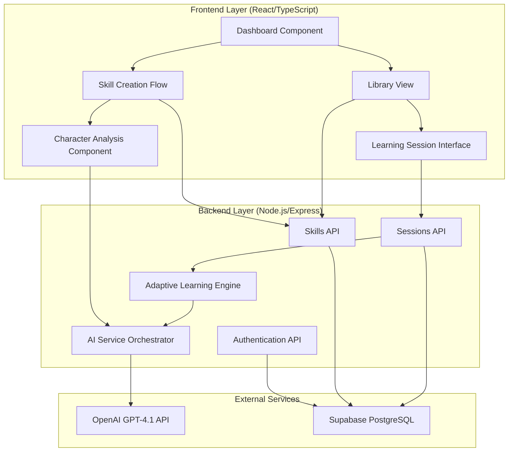

# Design Document: Adaptive AI Skill Mentor

## Overview

The Adaptive AI Skill Mentor is a full-stack web application that provides personalized, AI-powered skill development. The system consists of three primary layers:

1. **Frontend Layer**: React/TypeScript SPA with TailwindCSS and Framer Motion for a minimalist, animated UI
2. **Backend Layer**: Node.js/Express.js REST API handling business logic, AI orchestration, and data persistence
3. **Data Layer**: PostgreSQL database (via Supabase) storing user profiles, skills, roadmaps, sessions, and performance metrics

The core innovation is the adaptive learning engine that continuously adjusts content difficulty, mentor tone, and pacing based on real-time performance analysis. The system maintains persistent roadmaps that never regenerate, ensuring learning path consistency while dynamically adapting the delivery and difficulty of content within that structure.

## Architecture

### System Architecture Diagram



### Layer Responsibilities

**Frontend Layer**:
- Render minimalist UI with violet accents and smooth animations
- Handle user input and navigation
- Display real-time mastery scores and mentor responses
- Manage local UI state (form inputs, loading states, animations)

**Backend Layer**:
- Authenticate users and manage sessions
- Validate all incoming requests
- Orchestrate AI service calls with appropriate context
- Execute adaptive learning algorithms
- Persist all data to the database
- Proxy AI requests to protect API credentials

**Data Layer**:
- Store all persistent data (users, skills, roadmaps, sessions, performance logs)
- Enforce referential integrity through foreign key constraints
- Provide efficient queries for performance history and session retrieval


## Components and Interfaces

### Frontend Components

#### Dashboard Component
```typescript
interface DashboardProps {
  user: User;
}

interface DashboardState {
  isAnimating: boolean;
}

// Renders the main dashboard with violet glowing power button
// Provides navigation to "Create New Skill" and "Library"
```

#### Skill Creation Flow Component
```typescript
interface SkillCreationProps {
  userId: string;
  onComplete: (skillId: string) => void;
}

interface SkillFormData {
  skillName: string;
  goal: string;
  timeline: number;
}

// Handles skill creation form
// Triggers character analysis if needed
// Initiates roadmap generation
```

#### Character Analysis Component
```typescript
interface CharacterAnalysisProps {
  userId: string;
  onComplete: (profile: PersonalityProfile) => void;
  onSkip?: () => void;
}

interface AnalysisQuestion {
  id: string;
  question: string;
  userResponse: string;
}

// Conducts interactive character analysis
// Displays skip option if profile exists
// Submits responses to AI service for analysis
```

#### Library View Component
```typescript
interface LibraryProps {
  userId: string;
}

interface SkillCard {
  skillId: string;
  skillName: string;
  progressPercentage: number;
  masteryLevel: number;
  lastSessionDate: Date;
}

// Displays grid of skill cards
// Shows progress metrics for each skill
// Handles skill selection for session resumption
```

#### Learning Session Interface Component
```typescript
interface LearningSessionProps {
  skillId: string;
  sessionId: string;
}

interface SessionState {
  currentNode: RoadmapNode;
  masteryScore: number;
  confidenceLevel: string;
  mentorMode: MentorMode;
  messages: Message[];
}

// Displays active learning session
// Shows skill name, mastery score, mentor mode badge
// Handles user input and AI response display
// Updates performance metrics in real-time
```


### Backend API Endpoints

#### Authentication API
```typescript
POST /api/auth/register
  Body: { name: string, email: string, password: string }
  Response: { userId: string, token: string }

POST /api/auth/login
  Body: { email: string, password: string }
  Response: { userId: string, token: string }

GET /api/auth/profile
  Headers: { Authorization: Bearer <token> }
  Response: { user: User }
```

#### Skills API
```typescript
POST /api/skills
  Headers: { Authorization: Bearer <token> }
  Body: { skillName: string, goal: string, timeline: number }
  Response: { skillId: string }

GET /api/skills/:userId
  Headers: { Authorization: Bearer <token> }
  Response: { skills: Skill[] }

GET /api/skills/:skillId
  Headers: { Authorization: Bearer <token> }
  Response: { skill: Skill, roadmap: Roadmap }
```

#### Sessions API
```typescript
POST /api/sessions/start
  Headers: { Authorization: Bearer <token> }
  Body: { skillId: string }
  Response: { sessionId: string, recap: string, currentNode: RoadmapNode }

POST /api/sessions/:sessionId/interact
  Headers: { Authorization: Bearer <token> }
  Body: { userInput: string, accuracy: number, speed: number, attempts: number }
  Response: { mentorResponse: string, masteryScore: number, confidenceLevel: string, nextNode?: RoadmapNode, stretchTask?: Task }

PUT /api/sessions/:sessionId/end
  Headers: { Authorization: Bearer <token> }
  Body: { recapSummary: string }
  Response: { success: boolean }
```

#### Character Analysis API
```typescript
POST /api/character-analysis
  Headers: { Authorization: Bearer <token> }
  Body: { userId: string, responses: AnalysisResponse[] }
  Response: { profile: PersonalityProfile }

GET /api/character-analysis/:userId
  Headers: { Authorization: Bearer <token> }
  Response: { profile: PersonalityProfile | null }
```

#### Roadmap API
```typescript
POST /api/roadmaps/generate
  Headers: { Authorization: Bearer <token> }
  Body: { skillId: string, skillName: string, goal: string, timeline: number, profile: PersonalityProfile }
  Response: { roadmapId: string, structure: RoadmapNode[] }

GET /api/roadmaps/:skillId
  Headers: { Authorization: Bearer <token> }
  Response: { roadmap: Roadmap }
```

### Backend Services

#### Adaptive Learning Engine
```typescript
class AdaptiveLearningEngine {
  calculateMasteryScore(accuracy: number, speed: number): number {
    return (accuracy * 0.7) + (speed * 0.3);
  }
  
  deriveConfidenceLevel(
    languageTone: string,
    performanceTrend: number[],
    retryFrequency: number
  ): 'low' | 'medium' | 'high' {
    // Analyze patterns to determine confidence
  }
  
  shouldGenerateStretchTask(
    masteryScore: number,
    confidenceLevel: string
  ): boolean {
    return masteryScore > 80 && confidenceLevel === 'high';
  }
  
  adjustDifficulty(masteryScore: number): 'simplified' | 'standard' | 'advanced' {
    if (masteryScore < 50) return 'simplified';
    if (masteryScore > 80) return 'advanced';
    return 'standard';
  }
  
  selectMentorTone(confidenceLevel: string, userPreference: MentorMode): MentorMode {
    // Apply adaptive adjustments while respecting user preference
  }
}
```

#### AI Service Orchestrator
```typescript
class AIServiceOrchestrator {
  private apiKey: string;
  private baseURL: string = 'https://api.openai.com/v1';
  
  async generateRoadmap(
    skillName: string,
    goal: string,
    timeline: number,
    profile: PersonalityProfile
  ): Promise<RoadmapNode[]> {
    // Call GPT-4.1 with structured prompt
  }
  
  async conductCharacterAnalysis(
    responses: AnalysisResponse[]
  ): Promise<PersonalityProfile> {
    // Analyze responses to derive personality profile
  }
  
  async generateRecap(
    skill: Skill,
    session: Session,
    performanceHistory: PerformanceLog[]
  ): Promise<string> {
    // Generate personalized session recap
  }
  
  async generateMentorResponse(
    userInput: string,
    context: SessionContext,
    mentorMode: MentorMode,
    difficulty: string
  ): Promise<string> {
    // Generate adaptive mentor response
  }
  
  async generateStretchTask(
    currentNode: RoadmapNode,
    masteryScore: number
  ): Promise<Task> {
    // Generate optional advanced challenge
  }
}
```


## Data Models

### User Model
```typescript
interface User {
  id: string;              // UUID primary key
  name: string;            // User's display name
  email: string;           // Unique email address
  created_at: Date;        // Account creation timestamp
}
```

### Personality Profile Model
```typescript
interface PersonalityProfile {
  user_id: string;         // Foreign key to users.id
  tone_type: string;       // Preferred communication style
  confidence_level: string; // Initial confidence assessment
  motivation_index: number; // Motivation score (0-100)
}
```

### Skill Model
```typescript
interface Skill {
  id: string;              // UUID primary key
  user_id: string;         // Foreign key to users.id
  skill_name: string;      // Name of the skill
  goal: string;            // User's learning objective
  timeline: number;        // Expected completion time (days)
  created_at: Date;        // Skill creation timestamp
}
```

### Roadmap Model
```typescript
interface Roadmap {
  id: string;              // UUID primary key
  skill_id: string;        // Foreign key to skills.id
  structure_json: RoadmapNode[]; // Complete roadmap structure
  mastery_threshold: number; // Default threshold for nodes
}

interface RoadmapNode {
  node_id: string;         // Unique node identifier
  title: string;           // Node title
  description: string;     // Learning content description
  mastery_threshold: number; // Required score to unlock next node
  status: 'locked' | 'current' | 'completed';
  order: number;           // Sequential position in roadmap
}
```

### Session Model
```typescript
interface Session {
  id: string;              // UUID primary key
  skill_id: string;        // Foreign key to skills.id
  recap_summary: string;   // Summary for next session recap
  mastery_score: number;   // Current mastery score (0-100)
  confidence_level: string; // Current confidence level
  last_activity: Date;     // Last interaction timestamp
}
```

### Performance Log Model
```typescript
interface PerformanceLog {
  session_id: string;      // Foreign key to sessions.id
  accuracy: number;        // Correctness score (0-100)
  speed: number;           // Response speed score (0-100)
  attempts: number;        // Number of attempts for task
  timestamp: Date;         // When performance was recorded
}
```

### Supporting Types
```typescript
type MentorMode = 'Professional' | 'Friendly' | 'Supportive' | 'Challenger';

interface Message {
  id: string;
  sender: 'user' | 'mentor';
  content: string;
  timestamp: Date;
}

interface Task {
  id: string;
  description: string;
  isStretch: boolean;
}

interface SessionContext {
  skill: Skill;
  currentNode: RoadmapNode;
  masteryScore: number;
  confidenceLevel: string;
  performanceHistory: PerformanceLog[];
  personalityProfile: PersonalityProfile;
}
```


## Correctness Properties

A property is a characteristic or behavior that should hold true across all valid executions of a system—essentially, a formal statement about what the system should do. Properties serve as the bridge between human-readable specifications and machine-verifiable correctness guarantees.

### Property 1: User Registration Creates Complete Records

*For any* valid user registration data (name, email, password), creating a user account should result in a database record containing all required fields: id, name, email, and created_at timestamp.

**Validates: Requirements 1.1**

### Property 2: Authentication Round Trip

*For any* valid user credentials, successful login should establish a session that can be used to retrieve the same user's profile information.

**Validates: Requirements 1.2, 1.3**

### Property 3: Invalid Credentials Produce Safe Errors

*For any* invalid credentials, authentication attempts should fail with descriptive error messages that do not expose security details such as whether the email exists or password format requirements.

**Validates: Requirements 1.4**

### Property 4: First Skill Triggers Character Analysis

*For any* user without an existing Personality_Profile, creating their first skill should trigger Character_Analysis before roadmap generation.

**Validates: Requirements 2.1**

### Property 5: Character Analysis Stores Complete Profile

*For any* completed Character_Analysis, the resulting Personality_Profile should contain all required fields: user_id, tone_type, confidence_level, and motivation_index.

**Validates: Requirements 2.2**

### Property 6: Existing Profile Enables Skip Option

*For any* user with an existing Personality_Profile, the skill creation flow should provide an option to skip Character_Analysis.

**Validates: Requirements 2.3**

### Property 7: Profile Reuse Consistency

*For any* user with an existing Personality_Profile, skipping Character_Analysis should result in the same profile being used for roadmap generation.

**Validates: Requirements 2.4**

### Property 8: Character Analysis Produces Valid Mentor Mode

*For any* set of character analysis responses, the AI_Service should produce a Mentor_Mode that is one of: Professional, Friendly, Supportive, or Challenger.

**Validates: Requirements 2.5**

### Property 9: Skill Input Validation

*For any* skill creation input, the system should reject submissions where skill_name is empty or composed entirely of whitespace, or where timeline is zero or negative.

**Validates: Requirements 3.2**

### Property 10: Skill Creation Persistence

*For any* valid skill creation request, the system should store a complete skill record in the database with all required fields: id, user_id, skill_name, goal, timeline, and created_at.

**Validates: Requirements 3.3**

### Property 11: Roadmap Sequential Structure

*For any* generated roadmap, all nodes should have sequential order values with unique identifiers and defined mastery thresholds.

**Validates: Requirements 3.4, 11.1**

### Property 12: Roadmap Persistence Round Trip

*For any* generated roadmap, storing it to the database and then retrieving it should produce an equivalent structure_json with all nodes and thresholds intact.

**Validates: Requirements 3.5, 9.2, 20.1, 20.2**

### Property 13: Profile-Based Personalization

*For any* two different Personality_Profiles, generating roadmaps for the same skill should produce different content reflecting the personality differences.

**Validates: Requirements 3.6**

### Property 14: Mastery Score Calculation

*For any* accuracy value (0-100) and speed value (0-100), the calculated Mastery_Score should equal (accuracy × 0.7) + (speed × 0.3) and be within the range [0, 100].

**Validates: Requirements 4.1, 12.3**

### Property 15: Confidence Level Derivation

*For any* valid inputs (language tone, performance trends, retry frequency), the derived Confidence_Level should be one of: 'low', 'medium', or 'high'.

**Validates: Requirements 4.2, 12.4**

### Property 16: Node Progression on Threshold

*For any* roadmap node with a mastery_threshold, when the user's Mastery_Score meets or exceeds that threshold, the next node should be unlocked and the database should reflect the updated state.

**Validates: Requirements 4.5, 11.3, 11.4**

### Property 17: Adaptive Tone Adjustment

*For any* session with low Confidence_Level, the system should adjust the Mentor_Mode to use supportive tone, and for high Confidence_Level, should use motivating tone.

**Validates: Requirements 4.6, 4.7**

### Property 18: Performance Log Completeness

*For any* learning interaction, the stored performance log should contain all required fields: session_id, accuracy, speed, attempts, and timestamp.

**Validates: Requirements 4.8, 12.1, 12.2**

### Property 19: Mentor Mode Selection Persistence

*For any* selected Mentor_Mode, all subsequent AI_Service interactions within the same session should use that mode unless temporarily overridden by adaptive adjustments.

**Validates: Requirements 5.2**

### Property 20: Mentor Mode Prompt Configuration

*For any* Mentor_Mode change, the AI_Service prompt configuration should be updated to reflect the new tone before the next AI request.

**Validates: Requirements 5.3**

### Property 21: Mentor Mode Badge Display

*For any* active learning session, the rendered interface should include a visible badge displaying the current Mentor_Mode.

**Validates: Requirements 5.4, 8.4**

### Property 22: Adaptive Mode Preservation

*For any* user-selected Mentor_Mode, temporary adaptive adjustments should not permanently change the stored user preference, and the original mode should be restored when confidence returns to normal levels.

**Validates: Requirements 5.5**

### Property 23: Library Display Completeness

*For any* skill in the library, the displayed skill card should include progress percentage, mastery level, and last session date.

**Validates: Requirements 6.1**

### Property 24: Recap Generation on Selection

*For any* skill selected from the library, the AI_Service should generate a recap before the session begins.

**Validates: Requirements 6.2, 15.1**

### Property 25: Roadmap Immutability

*For any* skill, resuming the session multiple times should load the identical roadmap structure without regeneration, preserving all node IDs, titles, and thresholds.

**Validates: Requirements 6.3, 11.6, 20.3**

### Property 26: Session State Round Trip

*For any* session, storing mastery_score and confidence_level, then resuming the session should restore the exact same values.

**Validates: Requirements 6.4, 9.3**

### Property 27: Session Update Completeness

*For any* active session update, the persisted session data should include recap_summary, mastery_score, confidence_level, and last_activity timestamp.

**Validates: Requirements 6.5**

### Property 28: User Input Triggers AI Response

*For any* user input submitted during a learning session, the system should send it to the AI_Service and return a response.

**Validates: Requirements 8.5**

### Property 29: Real-Time Mastery Score Updates

*For any* performance metric change during a session, the displayed Mastery_Score should update without requiring page refresh.

**Validates: Requirements 8.6**

### Property 30: Skill Persistence Immediacy

*For any* created skill, querying the database immediately after creation should return the skill with all provided data intact.

**Validates: Requirements 9.1**

### Property 31: Performance Log Accumulation

*For any* session, collecting multiple performance metrics should result in multiple performance_log entries in the database, all associated with the correct session_id.

**Validates: Requirements 9.4**

### Property 32: Personality Profile Persistence

*For any* created or updated Personality_Profile, the database should store it linked to the correct user_id and retrieval should return the same profile data.

**Validates: Requirements 9.5**

### Property 33: Referential Integrity Enforcement

*For any* attempt to delete a user with associated skills, the database should either prevent the deletion or cascade delete all related records (skills, roadmaps, sessions, performance_logs) to maintain referential integrity.

**Validates: Requirements 9.6, 18.7**

### Property 34: API Key Exclusion from Responses

*For any* backend response to the frontend, the response body should not contain OpenAI API keys or any environment variable secrets.

**Validates: Requirements 10.2, 19.2**

### Property 35: AI Request Proxy Pattern

*For any* frontend AI operation request, the backend should make the actual API call to OpenAI without requiring the frontend to provide credentials.

**Validates: Requirements 10.3, 19.3**

### Property 36: Authenticated AI Requests Only

*For any* AI_Service request, the backend should verify the request includes valid authentication, and reject unauthenticated requests.

**Validates: Requirements 10.4, 19.4**

### Property 37: Unauthorized Access Rejection and Logging

*For any* unauthorized API access attempt, the backend should reject the request with an appropriate error and create a log entry of the attempt.

**Validates: Requirements 10.5, 19.5**

### Property 38: AI Context Inclusion

*For any* AI_Service request, the backend should include the user's Personality_Profile data and current performance metrics in the prompt context.

**Validates: Requirements 10.6**

### Property 39: Learning Session Starts at First Node

*For any* new learning session, the system should initialize the session at the first node (order = 0 or order = 1) in the roadmap.

**Validates: Requirements 11.2**

### Property 40: Roadmap Visual Status Indicators

*For any* displayed roadmap, each node should have a visual status indicator showing whether it is locked, current, or completed.

**Validates: Requirements 11.5**

### Property 41: Performance Trend Analysis Uses History

*For any* performance trend analysis, the system should query and use historical performance_logs associated with the session.

**Validates: Requirements 12.5**

### Property 42: Database Failure Error Handling

*For any* database connection failure, the system should return an error message and not proceed with operations that would corrupt data.

**Validates: Requirements 13.1**

### Property 43: AI Service Unavailability Handling

*For any* AI_Service unavailability, the system should return a user-friendly error message suggesting retry.

**Validates: Requirements 13.2**

### Property 44: Invalid Input Error Messages

*For any* invalid data submission, the system should validate the input and return specific error messages describing what is invalid.

**Validates: Requirements 13.3**

### Property 45: Session Interruption State Preservation

*For any* session that is interrupted, the last known state (mastery_score, confidence_level, current node) should be preserved in the database and recoverable.

**Validates: Requirements 13.4**

### Property 46: Error Logging and User Messages

*For any* error that occurs, the system should both log detailed error information for debugging and return a user-friendly message to the frontend.

**Validates: Requirements 13.5**

### Property 47: Stretch Task Optional Marking

*For any* generated Stretch_Task, the frontend display should clearly indicate that the task is optional.

**Validates: Requirements 14.3**

### Property 48: Stretch Task Non-Blocking Progression

*For any* Stretch_Task, whether the user completes it or skips it, progression to the next node should not be blocked.

**Validates: Requirements 14.4, 14.5**

### Property 49: Recap Content Completeness

*For any* generated recap, it should include the last topic covered, current mastery level, and next recommended action.

**Validates: Requirements 15.2**

### Property 50: Recap Summary Round Trip

*For any* session, storing a recap_summary when ending the session, then resuming the skill should result in a recap that incorporates that stored summary.

**Validates: Requirements 15.4**

### Property 51: Recap Personalization

*For any* two different Personality_Profiles, generating recaps for the same skill and session data should produce different personalized content.

**Validates: Requirements 15.5**

### Property 52: Input Validation Before Processing

*For any* backend request with invalid data, the system should reject the request before performing any side effects (database writes, AI calls).

**Validates: Requirements 17.4**

### Property 53: HTTP Response Format

*For any* backend API response, it should include an appropriate HTTP status code and a valid JSON body.

**Validates: Requirements 17.5**

### Property 54: Roadmap Structure Immutability During Adaptation

*For any* skill with adaptive adjustments applied across multiple sessions, the roadmap structure_json should remain byte-for-byte identical.

**Validates: Requirements 20.4**

### Property 55: Node State Persistence

*For any* roadmap with nodes in various states (locked, current, completed), storing and retrieving the roadmap should preserve all node states exactly.

**Validates: Requirements 20.5**


## Error Handling

### Error Categories

**Authentication Errors**:
- Invalid credentials: Return 401 with message "Invalid email or password"
- Missing token: Return 401 with message "Authentication required"
- Expired token: Return 401 with message "Session expired, please log in again"

**Validation Errors**:
- Empty skill name: Return 400 with message "Skill name cannot be empty"
- Invalid timeline: Return 400 with message "Timeline must be a positive number"
- Missing required fields: Return 400 with message "Missing required field: {field_name}"

**Database Errors**:
- Connection failure: Return 503 with message "Service temporarily unavailable, please try again"
- Constraint violation: Return 409 with message "Operation conflicts with existing data"
- Query timeout: Return 504 with message "Request timeout, please try again"

**AI Service Errors**:
- API unavailable: Return 503 with message "AI service temporarily unavailable"
- Rate limit exceeded: Return 429 with message "Too many requests, please wait before retrying"
- Invalid API response: Return 502 with message "Unable to process AI response"

**Resource Not Found Errors**:
- Skill not found: Return 404 with message "Skill not found"
- Session not found: Return 404 with message "Session not found"
- User not found: Return 404 with message "User not found"

### Error Handling Strategy

**Backend Error Handling**:
1. Wrap all database operations in try-catch blocks
2. Log full error details (stack trace, context) to server logs
3. Return sanitized error messages to frontend
4. Use appropriate HTTP status codes
5. Implement retry logic for transient failures (database connections, AI API calls)

**Frontend Error Handling**:
1. Display user-friendly error messages in toast notifications
2. Provide actionable guidance (e.g., "Please try again" or "Check your input")
3. Maintain UI state during errors (don't clear forms unnecessarily)
4. Implement loading states to prevent duplicate submissions
5. Log errors to browser console for debugging

**Session Interruption Handling**:
1. Implement auto-save every 30 seconds during active sessions
2. Store last known state before any state-changing operation
3. On session resume, check for incomplete operations and recover
4. Provide "Resume Session" option if interruption detected


## Testing Strategy

### Dual Testing Approach

The system will use both unit testing and property-based testing to ensure comprehensive coverage:

**Unit Tests**: Verify specific examples, edge cases, and error conditions
- Test concrete scenarios with known inputs and expected outputs
- Validate error handling with specific invalid inputs
- Test integration points between components
- Verify UI component rendering with specific props

**Property Tests**: Verify universal properties across all inputs
- Test correctness properties with randomly generated data
- Ensure properties hold across 100+ iterations per test
- Validate business logic invariants
- Test round-trip properties (serialization, persistence, state management)

Both approaches are complementary and necessary. Unit tests catch concrete bugs and validate specific behaviors, while property tests verify general correctness across the input space.

### Property-Based Testing Configuration

**Library Selection**:
- **Frontend (TypeScript)**: Use `fast-check` library for property-based testing
- **Backend (TypeScript/Node.js)**: Use `fast-check` library for property-based testing

**Test Configuration**:
- Minimum 100 iterations per property test
- Each property test must include a comment tag referencing the design property
- Tag format: `// Feature: adaptive-ai-skill-mentor, Property {number}: {property_text}`

**Example Property Test Structure**:
```typescript
import fc from 'fast-check';

// Feature: adaptive-ai-skill-mentor, Property 14: Mastery Score Calculation
test('mastery score calculation is correct for all inputs', () => {
  fc.assert(
    fc.property(
      fc.float({ min: 0, max: 100 }), // accuracy
      fc.float({ min: 0, max: 100 }), // speed
      (accuracy, speed) => {
        const masteryScore = calculateMasteryScore(accuracy, speed);
        const expected = (accuracy * 0.7) + (speed * 0.3);
        expect(masteryScore).toBeCloseTo(expected, 2);
        expect(masteryScore).toBeGreaterThanOrEqual(0);
        expect(masteryScore).toBeLessThanOrEqual(100);
      }
    ),
    { numRuns: 100 }
  );
});
```

### Testing Coverage Requirements

**Unit Test Coverage**:
- All API endpoints with valid and invalid inputs
- All React components with various prop combinations
- Error handling paths for each error category
- Edge cases: empty strings, boundary values, null/undefined
- Database schema validation and constraints

**Property Test Coverage**:
- Each correctness property from the design document
- All mathematical formulas (mastery score, confidence derivation)
- All round-trip operations (persistence, serialization, state management)
- Input validation across the input space
- Referential integrity and data consistency

**Integration Test Coverage**:
- Complete user flows: registration → skill creation → learning session
- Character analysis → roadmap generation → session continuity
- Library selection → recap generation → session resumption
- Adaptive adjustments during active sessions

### Test Organization

**Frontend Tests**:
- `src/components/__tests__/`: Component unit tests
- `src/services/__tests__/`: API client unit tests
- `src/properties/__tests__/`: Property-based tests for frontend logic

**Backend Tests**:
- `src/api/__tests__/`: API endpoint unit tests
- `src/services/__tests__/`: Service layer unit tests
- `src/engine/__tests__/`: Adaptive engine unit tests
- `src/properties/__tests__/`: Property-based tests for backend logic
- `src/integration/__tests__/`: Integration tests

### Continuous Testing

- Run unit tests on every commit
- Run property tests on every pull request
- Run integration tests before deployment
- Monitor test execution time and optimize slow tests
- Maintain test coverage above 80% for critical paths
